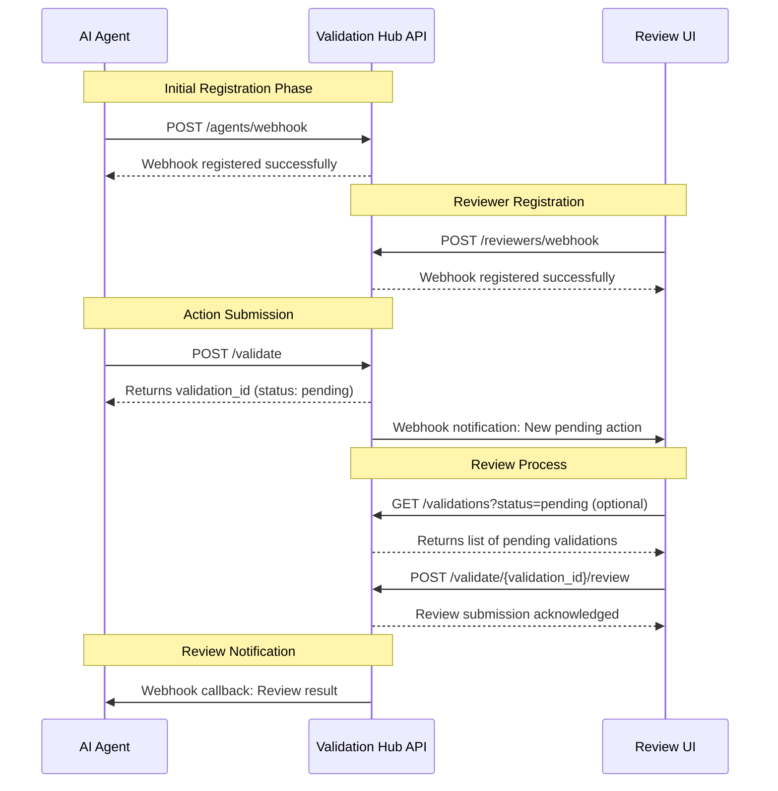

# AI Action Validation Hub

A centralized validation system where AI agents can submit actions for human review and approval. This hub provides a simple way to keep humans in the loop for AI agent actions.

## Features

- **FastAPI Backend**: RESTful API for action submission and validation
- **Streamlit Frontend**: User-friendly interface for reviewing and validating actions
- **Python SDK**: Easy integration for AI agents
- **Real-time Updates**: Webhook support for instant notifications
- **Multiple Action Types**: Support for various action types (email drafts, social posts, code changes, etc.)

## Project Structure

```
ai_validation_hub/
├── backend/
│   └── app/
│       ├── models/
│       ├── api/
│       ├── core/
│       └── main.py
├── frontend/
│   ├── pages/
│   └── main.py
├── sdk/
│   └── validation_hub_sdk/
│       └── client.py
├── tests/
│   └── test_agent.py
├── requirements.txt
├── run_local_test.sh
└── README.md
```

## Installation

1. Clone the repository:
```bash
git clone <repository-url>
cd ai_validation_hub
```

2. Create and activate a virtual environment:
```bash
python -m venv venv
source venv/bin/activate  # On Windows: venv\Scripts\activate
```

3. Install dependencies:
```bash
pip install -r requirements.txt
pip install -e .  # Install the SDK in development mode
```

4. Make the test script executable:
```bash
chmod +x run_local_test.sh
```

## Running the Tests

To test the entire system locally:

```bash
./run_local_test.sh
```

This will:
1. Start the FastAPI backend server (http://localhost:8000)
2. Launch the Streamlit frontend (http://localhost:8501)
3. Run a test agent that submits sample actions for validation

## Components

### Backend API

- Submit actions for validation
- Check validation status
- Register webhooks for updates
- Review and provide feedback on actions

### Frontend UI

- View pending validations
- Approve or reject actions
- Provide feedback
- Real-time updates

### SDK

- Python client for easy integration
- Async support
- Type hints and documentation
- Error handling

### Test Agent

- Generates random test actions
- Monitors validation status
- Displays feedback in real-time

## Usage Example

```python
from validation_hub_sdk import ValidationClient

# Initialize the client
client = ValidationClient("http://localhost:8000")

# Submit an action
validation_id = client.submit_action(
    agent_id="my_agent",
    user_id="user_123",
    action_type="email_draft",
    content="Hello, this is a draft email...",
    metadata={"priority": "high"}
)

# Check status
status, feedback = client.get_validation_status(validation_id)
```

## Development Status

Current implementation is a working prototype with:
- In-memory storage (PostgreSQL integration planned)
- Basic authentication
- Local webhook support

### API Diagram


## Contributing

Contributions are welcome! Please feel free to submit a Pull Request.
